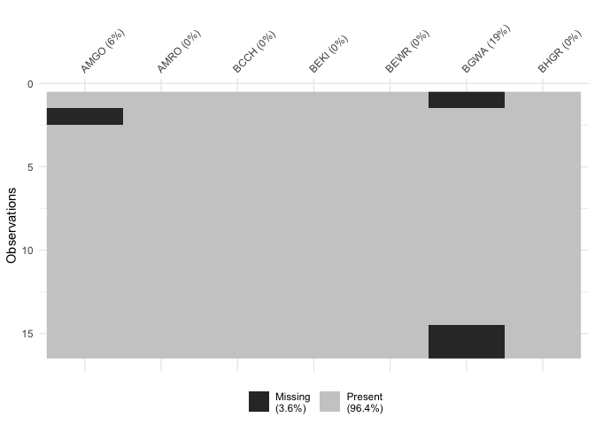

# 0. Credits
Material is taken directly from the UMass Landscape Ecology lab's multivariate statistics course, specifically from the [data screening lesson](https://www.umass.edu/landeco/teaching/multivariate/schedule/data.screen.pdf). Code was written by An Bui.


```r
library(here)
```

```
## here() starts at /Users/An/github/UCSB-EEMB-Multivariate_Statistics_2021
```

```r
library(tidyverse)
```

```
## ── Attaching core tidyverse packages ──────────────────────── tidyverse 2.0.0 ──
## ✔ dplyr     1.1.4     ✔ readr     2.1.5
## ✔ forcats   1.0.0     ✔ stringr   1.5.1
## ✔ ggplot2   3.5.1     ✔ tibble    3.2.1
## ✔ lubridate 1.9.3     ✔ tidyr     1.3.1
## ✔ purrr     1.0.2
```

```
## ── Conflicts ────────────────────────────────────────── tidyverse_conflicts() ──
## ✖ dplyr::filter() masks stats::filter()
## ✖ dplyr::lag()    masks stats::lag()
## ℹ Use the conflicted package (<http://conflicted.r-lib.org/>) to force all conflicts to become errors
```

```r
library(skimr)
library(naniar)
```

```
## 
## Attaching package: 'naniar'
## 
## The following object is masked from 'package:skimr':
## 
##     n_complete
```

```r
library(vegan)
```

```
## Loading required package: permute
## Loading required package: lattice
## This is vegan 2.6-6.1
```


# 1. Why screen our data?

Datasets aren't perfect. Sometimes you have missing data, insufficient samples, outliers, and many more things that make your life a little harder. That's where screening comes in - you can check up on what's weird about your data, and fix it using a transformation or a standardization.  

We'll use this fake dataset of bird counts and sites for today.


```r
birds <- read_csv(here::here("week_01", "birds_arent_real.csv"))
```

```
## Rows: 16 Columns: 7
## ── Column specification ────────────────────────────────────────────────────────
## Delimiter: ","
## dbl (7): AMGO, AMRO, BCCH, BEKI, BEWR, BGWA, BHGR
## 
## ℹ Use `spec()` to retrieve the full column specification for this data.
## ℹ Specify the column types or set `show_col_types = FALSE` to quiet this message.
```


## 1a. Data screening for errors

Errors occur when there's just something wrong with the raw data. You can look at summary statistics or visualizations to check for irregularities in the data.


```r
# base
summary(birds)
```

```
##       AMGO              AMRO            BCCH           BEKI       
##  Min.   :0.00000   Min.   :0.000   Min.   :0.00   Min.   :0.0000  
##  1st Qu.:0.00000   1st Qu.:0.000   1st Qu.:0.00   1st Qu.:0.0000  
##  Median :0.00000   Median :1.000   Median :0.00   Median :0.0000  
##  Mean   :0.06667   Mean   :1.062   Mean   :0.25   Mean   :0.3125  
##  3rd Qu.:0.00000   3rd Qu.:1.250   3rd Qu.:0.00   3rd Qu.:0.0000  
##  Max.   :1.00000   Max.   :5.000   Max.   :2.00   Max.   :5.0000  
##  NA's   :1                                                        
##       BEWR            BGWA            BHGR       
##  Min.   :0.000   Min.   :0.000   Min.   : 1.000  
##  1st Qu.:0.000   1st Qu.:2.000   1st Qu.: 1.000  
##  Median :0.000   Median :2.000   Median : 1.000  
##  Mean   :0.125   Mean   :1.538   Mean   : 3.688  
##  3rd Qu.:0.000   3rd Qu.:2.000   3rd Qu.: 5.000  
##  Max.   :1.000   Max.   :2.000   Max.   :25.000  
##                  NA's   :3
```

```r
# fancy options
skimr::skim(birds)
```


Table: Data summary

|                         |      |
|:------------------------|:-----|
|Name                     |birds |
|Number of rows           |16    |
|Number of columns        |7     |
|_______________________  |      |
|Column type frequency:   |      |
|numeric                  |7     |
|________________________ |      |
|Group variables          |None  |


**Variable type: numeric**

|skim_variable | n_missing| complete_rate| mean|   sd| p0| p25| p50|  p75| p100|hist  |
|:-------------|---------:|-------------:|----:|----:|--:|---:|---:|----:|----:|:-----|
|AMGO          |         1|          0.94| 0.07| 0.26|  0|   0|   0| 0.00|    1|▇▁▁▁▁ |
|AMRO          |         0|          1.00| 1.06| 1.39|  0|   0|   1| 1.25|    5|▇▁▁▁▁ |
|BCCH          |         0|          1.00| 0.25| 0.58|  0|   0|   0| 0.00|    2|▇▁▁▁▁ |
|BEKI          |         0|          1.00| 0.31| 1.25|  0|   0|   0| 0.00|    5|▇▁▁▁▁ |
|BEWR          |         0|          1.00| 0.12| 0.34|  0|   0|   0| 0.00|    1|▇▁▁▁▁ |
|BGWA          |         3|          0.81| 1.54| 0.88|  0|   2|   2| 2.00|    2|▂▁▁▁▇ |
|BHGR          |         0|          1.00| 3.69| 5.96|  1|   1|   1| 5.00|   25|▇▁▁▁▁ |

```r
naniar::vis_miss(birds)
```

<!-- -->

The recommended action here is to just go through and correct what might be wrong. **Important note:** these are situations where there was human error in entering data, etc. If those missing or weird values are real, then you can move onto the next step.

## 1b. Data screening for missing data

If you want to fill in missing data, you can:  
  1. replace values with prior knowledge  
  2. Insert means or medians  
  3. estimate values using regression  

I imagine the choice for which to use depends on you! For simplicity, I'll just demonstrate replacing medians using `dplyr::mutate()`. In the `mutate_all()` line of code, you're telling R: mutate across all columns following this rule: if there is an NA, replace it with the median.

```r
new_birds <- birds %>% 
  mutate_all(~ifelse(is.na(.), median(., na.rm = TRUE), .))

# new_birds <- birds %>% 
#   mutate_all(~ifelse(is.na(.), mean(., na.rm = TRUE), .))
```

You can also take those NAs out entirely (omit observations with NAs). That's up to you though.

## 1c. Data screening for sufficiency

Sometimes you're going to get insufficiently sampled variables - for example, rare species in a community dataset. Alternatively, you may get overrepresented variables - for example, abundant species in a dataset. Even further, you could get variables with no meaningful pattern in the data.  

If you want to discard variables (columns) based on abundance, you can do that with `purrr::discard()`. As an example, I'll discard all species with NAs for more than or equal to 5% of observations (**not** a realistic cut off!! Just an example!).  

What you're telling R is: for each column in the data frame `birds`, evaluate if the percent of NAs in the column is greater than 5, and if so discard.


```r
birds %>% 
  purrr::discard(~ sum(is.na(.x))/length(.x) * 100 >= 5)
```

```
## # A tibble: 16 × 5
##     AMRO  BCCH  BEKI  BEWR  BHGR
##    <dbl> <dbl> <dbl> <dbl> <dbl>
##  1     1     0     5     0    25
##  2     0     0     0     0     4
##  3     5     2     0     0     1
##  4     0     0     0     0     1
##  5     3     0     0     1     1
##  6     1     0     0     0     1
##  7     0     0     0     0     1
##  8     0     0     0     0     1
##  9     0     0     0     0     1
## 10     0     0     0     0     1
## 11     1     1     0     0     1
## 12     2     0     0     0     1
## 13     0     1     0     0     5
## 14     2     0     0     1     5
## 15     1     0     0     0     5
## 16     1     0     0     0     5
```

# 2. Transformations and standardizations

Sometimes you need to transform or standardize your data to:  
  1. improve assumptions of normality, linearity, homogeneity of variance, etc.  
  2. make units of variables comparable when measured on different scales (very common!)  
  3. make distance measures work better  
  4. reduce effect of total quantity in sample units to put focus on relative quantities  
  5. equalize or alter relative importance of variables  
  6. emphasize informative variables at the expense of uninformative variables  

**Transformations** are applied to each element of the data matrix and are independent of the other elements. **Standardizations** adjust matrix elements by rows or column standards (like max, min, sum, etc.)  

## 2a. Transformations

You can transform your data matrix when you have:  
  - highly skewed variables  
  - to meet assumptions of statistical tests  
  - to emphasize presence/absence  
  
Generally, presence/absence transformations are useful when you have a high number of 0s, low number of distinct values, and high beta diversity. Log or square root transformations are good for highly skewed data ranging over several orders of magnitude. Arcsine squareroot transformations are useful for proportion data. Some of these transformations are available using `vegan::decostand()`. 
  
### i. binary presence absence

This converts quantitative data (abundance) to nonquantitative data (presence/absence). It can be useful when there's little quantitative information present, but it's a big transformation.  
Using `dplyr::mutate_all()` to replace all values in `new_birds` that are greater than 1 with 1.


```r
new_birds %>% 
  mutate_all(~replace(., . > 1, 1))
```

```
## # A tibble: 16 × 7
##     AMGO  AMRO  BCCH  BEKI  BEWR  BGWA  BHGR
##    <dbl> <dbl> <dbl> <dbl> <dbl> <dbl> <dbl>
##  1     0     1     0     1     0     1     1
##  2     0     0     0     0     0     0     1
##  3     0     1     1     0     0     1     1
##  4     0     0     0     0     0     1     1
##  5     0     1     0     0     1     1     1
##  6     1     1     0     0     0     1     1
##  7     0     0     0     0     0     1     1
##  8     0     0     0     0     0     1     1
##  9     0     0     0     0     0     1     1
## 10     0     0     0     0     0     1     1
## 11     0     1     1     0     0     1     1
## 12     0     1     0     0     0     1     1
## 13     0     0     1     0     0     0     1
## 14     0     1     0     0     1     0     1
## 15     0     1     0     0     0     1     1
## 16     0     1     0     0     0     1     1
```

```r
decostand(new_birds, method = "pa")
```

```
##    AMGO AMRO BCCH BEKI BEWR BGWA BHGR
## 1     0    1    0    1    0    1    1
## 2     0    0    0    0    0    0    1
## 3     0    1    1    0    0    1    1
## 4     0    0    0    0    0    1    1
## 5     0    1    0    0    1    1    1
## 6     1    1    0    0    0    1    1
## 7     0    0    0    0    0    1    1
## 8     0    0    0    0    0    1    1
## 9     0    0    0    0    0    1    1
## 10    0    0    0    0    0    1    1
## 11    0    1    1    0    0    1    1
## 12    0    1    0    0    0    1    1
## 13    0    0    1    0    0    0    1
## 14    0    1    0    0    1    0    1
## 15    0    1    0    0    0    1    1
## 16    0    1    0    0    0    1    1
```

### ii. log transformation

Log transforming compresses high values and spreads low values by expressing those values as orders of magnitude. It's useful when there's a high degree of variation in abundance data or highly positively skewed data. Log transformation takes the form of taking the log of whatever it is that you're transforming and adding 1. You can choose the base of your log based on how much you want those values to be compressed.


```r
new_birds %>% 
  mutate_if(is.numeric, ~ ifelse(. > 0, (log2(.) + 1), 0))
```

```
## # A tibble: 16 × 7
##     AMGO  AMRO  BCCH  BEKI  BEWR  BGWA  BHGR
##    <dbl> <dbl> <dbl> <dbl> <dbl> <dbl> <dbl>
##  1     0  1        0  3.32     0     2  5.64
##  2     0  0        0  0        0     0  3   
##  3     0  3.32     2  0        0     2  1   
##  4     0  0        0  0        0     2  1   
##  5     0  2.58     0  0        1     2  1   
##  6     1  1        0  0        0     2  1   
##  7     0  0        0  0        0     2  1   
##  8     0  0        0  0        0     2  1   
##  9     0  0        0  0        0     2  1   
## 10     0  0        0  0        0     2  1   
## 11     0  1        1  0        0     2  1   
## 12     0  2        0  0        0     2  1   
## 13     0  0        1  0        0     0  3.32
## 14     0  2        0  0        1     0  3.32
## 15     0  1        0  0        0     2  3.32
## 16     0  1        0  0        0     2  3.32
```

```r
decostand(new_birds, method = "log")
```

```
##    AMGO     AMRO BCCH     BEKI BEWR BGWA     BHGR
## 1     0 1.000000    0 3.321928    0    2 5.643856
## 2     0 0.000000    0 0.000000    0    0 3.000000
## 3     0 3.321928    2 0.000000    0    2 1.000000
## 4     0 0.000000    0 0.000000    0    2 1.000000
## 5     0 2.584963    0 0.000000    1    2 1.000000
## 6     1 1.000000    0 0.000000    0    2 1.000000
## 7     0 0.000000    0 0.000000    0    2 1.000000
## 8     0 0.000000    0 0.000000    0    2 1.000000
## 9     0 0.000000    0 0.000000    0    2 1.000000
## 10    0 0.000000    0 0.000000    0    2 1.000000
## 11    0 1.000000    1 0.000000    0    2 1.000000
## 12    0 2.000000    0 0.000000    0    2 1.000000
## 13    0 0.000000    1 0.000000    0    0 3.321928
## 14    0 2.000000    0 0.000000    1    0 3.321928
## 15    0 1.000000    0 0.000000    0    2 3.321928
## 16    0 1.000000    0 0.000000    0    2 3.321928
```

### iii. square root transformation

This has a similar effect to but is less dramatic than the log transform. It's often used with count data when the mean is equal to the variance (or things follow in Poisson distribution).


```r
sqrt(new_birds)
```

```
## # A tibble: 16 × 7
##     AMGO  AMRO  BCCH  BEKI  BEWR  BGWA  BHGR
##    <dbl> <dbl> <dbl> <dbl> <dbl> <dbl> <dbl>
##  1     0  1     0     2.24     0  1.41  5   
##  2     0  0     0     0        0  0     2   
##  3     0  2.24  1.41  0        0  1.41  1   
##  4     0  0     0     0        0  1.41  1   
##  5     0  1.73  0     0        1  1.41  1   
##  6     1  1     0     0        0  1.41  1   
##  7     0  0     0     0        0  1.41  1   
##  8     0  0     0     0        0  1.41  1   
##  9     0  0     0     0        0  1.41  1   
## 10     0  0     0     0        0  1.41  1   
## 11     0  1     1     0        0  1.41  1   
## 12     0  1.41  0     0        0  1.41  1   
## 13     0  0     1     0        0  0     2.24
## 14     0  1.41  0     0        1  0     2.24
## 15     0  1     0     0        0  1.41  2.24
## 16     0  1     0     0        0  1.41  2.24
```

### iv. power transformations

These raise the matrix to some power (a square root transformation is a power transformation to the 0.5). Different exponents change the effect of the transformation - the smaller the exponent, the more compression applied to higher values. It's flexible for a wide variety of data.


```r
(new_birds)^0.5
```

```
##    AMGO     AMRO     BCCH     BEKI BEWR     BGWA     BHGR
## 1     0 1.000000 0.000000 2.236068    0 1.414214 5.000000
## 2     0 0.000000 0.000000 0.000000    0 0.000000 2.000000
## 3     0 2.236068 1.414214 0.000000    0 1.414214 1.000000
## 4     0 0.000000 0.000000 0.000000    0 1.414214 1.000000
## 5     0 1.732051 0.000000 0.000000    1 1.414214 1.000000
## 6     1 1.000000 0.000000 0.000000    0 1.414214 1.000000
## 7     0 0.000000 0.000000 0.000000    0 1.414214 1.000000
## 8     0 0.000000 0.000000 0.000000    0 1.414214 1.000000
## 9     0 0.000000 0.000000 0.000000    0 1.414214 1.000000
## 10    0 0.000000 0.000000 0.000000    0 1.414214 1.000000
## 11    0 1.000000 1.000000 0.000000    0 1.414214 1.000000
## 12    0 1.414214 0.000000 0.000000    0 1.414214 1.000000
## 13    0 0.000000 1.000000 0.000000    0 0.000000 2.236068
## 14    0 1.414214 0.000000 0.000000    1 0.000000 2.236068
## 15    0 1.000000 0.000000 0.000000    0 1.414214 2.236068
## 16    0 1.000000 0.000000 0.000000    0 1.414214 2.236068
```

```r
(new_birds)^0.3
```

```
##    AMGO     AMRO     BCCH     BEKI BEWR     BGWA     BHGR
## 1     0 1.000000 0.000000 1.620657    0 1.231144 2.626528
## 2     0 0.000000 0.000000 0.000000    0 0.000000 1.515717
## 3     0 1.620657 1.231144 0.000000    0 1.231144 1.000000
## 4     0 0.000000 0.000000 0.000000    0 1.231144 1.000000
## 5     0 1.390389 0.000000 0.000000    1 1.231144 1.000000
## 6     1 1.000000 0.000000 0.000000    0 1.231144 1.000000
## 7     0 0.000000 0.000000 0.000000    0 1.231144 1.000000
## 8     0 0.000000 0.000000 0.000000    0 1.231144 1.000000
## 9     0 0.000000 0.000000 0.000000    0 1.231144 1.000000
## 10    0 0.000000 0.000000 0.000000    0 1.231144 1.000000
## 11    0 1.000000 1.000000 0.000000    0 1.231144 1.000000
## 12    0 1.231144 0.000000 0.000000    0 1.231144 1.000000
## 13    0 0.000000 1.000000 0.000000    0 0.000000 1.620657
## 14    0 1.231144 0.000000 0.000000    1 0.000000 1.620657
## 15    0 1.000000 0.000000 0.000000    0 1.231144 1.620657
## 16    0 1.000000 0.000000 0.000000    0 1.231144 1.620657
```

### v. Arcsin square root transformation

This spreads the end of the scale while compressing the middle. It's useful for proportion data with positive skew (if you have negative skew, you can use the arcsine transfomration without the square root).


```r
(2/pi)*asin(sqrt(new_birds))
```

```
## Warning in FUN(X[[i]], ...): NaNs produced

## Warning in FUN(X[[i]], ...): NaNs produced

## Warning in FUN(X[[i]], ...): NaNs produced

## Warning in FUN(X[[i]], ...): NaNs produced

## Warning in FUN(X[[i]], ...): NaNs produced
```

```
##    AMGO AMRO BCCH BEKI BEWR BGWA BHGR
## 1     0    1    0  NaN    0  NaN  NaN
## 2     0    0    0    0    0    0  NaN
## 3     0  NaN  NaN    0    0  NaN    1
## 4     0    0    0    0    0  NaN    1
## 5     0  NaN    0    0    1  NaN    1
## 6     1    1    0    0    0  NaN    1
## 7     0    0    0    0    0  NaN    1
## 8     0    0    0    0    0  NaN    1
## 9     0    0    0    0    0  NaN    1
## 10    0    0    0    0    0  NaN    1
## 11    0    1    1    0    0  NaN    1
## 12    0  NaN    0    0    0  NaN    1
## 13    0    0    1    0    0    0  NaN
## 14    0  NaN    0    0    1    0  NaN
## 15    0    1    0    0    0  NaN  NaN
## 16    0    1    0    0    0  NaN  NaN
```

## 2b. Standardizations

Standardizations are useful when you want to place unequal sample units or variables on equal footing. They can also better represent patterns. The effects of standardization vary amongst datasets, but generally the more variability amongst rows or columns, the larger the effect on the results.    

Standardizations adjust matrices by row or column standards, and all standardizations can be applied to either rows or columns (or both).  

If you want to adjust for differences among variables (species), then you'll want to use a column standardization. This is useful when you want to focus across sample units. Alternatively, if the focus is within a sample unit, then you can do a row standardization to adjust for differences amongst sample units.  

A lot of these standardization methods are available with the function `vegan::decostand()`. In `decostand()`, the `MARGIN` argument refers to the standarization happening across rows or columns: `MARGIN = 1` is for rows, and `MARGIN = 2` is for columns. Some of the `MARGIN` arguments are default, but it might be good practice to specify directly.  

### Z-score

This converts data to z-scores where the mean is 0 and the variance is 1. It's used to place variables (species) on equal footing. It's also useful when variables have different scales or units of measurement. The Z is (x - mean)/standard deviation.  

You can use `apply()` to apply the function to calculate Z-scores across all columns in the data frame. Shout out to stack overflow, fr.


```r
apply(new_birds[, 1:7], 2, function(x) (x - mean(x))/sd(x))
```

```
##        AMGO       AMRO       BCCH  BEKI       BEWR       BGWA        BHGR
##  [1,] -0.25 -0.0449982 -0.4330127  3.75 -0.3659625  0.4651303  3.57386591
##  [2,] -0.25 -0.7649694 -0.4330127 -0.25 -0.3659625 -2.0155644  0.05240273
##  [3,] -0.25  2.8348866  3.0310889 -0.25 -0.3659625  0.4651303 -0.45066344
##  [4,] -0.25 -0.7649694 -0.4330127 -0.25 -0.3659625  0.4651303 -0.45066344
##  [5,] -0.25  1.3949442 -0.4330127 -0.25  2.5617377  0.4651303 -0.45066344
##  [6,]  3.75 -0.0449982 -0.4330127 -0.25 -0.3659625  0.4651303 -0.45066344
##  [7,] -0.25 -0.7649694 -0.4330127 -0.25 -0.3659625  0.4651303 -0.45066344
##  [8,] -0.25 -0.7649694 -0.4330127 -0.25 -0.3659625  0.4651303 -0.45066344
##  [9,] -0.25 -0.7649694 -0.4330127 -0.25 -0.3659625  0.4651303 -0.45066344
## [10,] -0.25 -0.7649694 -0.4330127 -0.25 -0.3659625  0.4651303 -0.45066344
## [11,] -0.25 -0.0449982  1.2990381 -0.25 -0.3659625  0.4651303 -0.45066344
## [12,] -0.25  0.6749730 -0.4330127 -0.25 -0.3659625  0.4651303 -0.45066344
## [13,] -0.25 -0.7649694  1.2990381 -0.25 -0.3659625 -2.0155644  0.22009145
## [14,] -0.25  0.6749730 -0.4330127 -0.25  2.5617377 -2.0155644  0.22009145
## [15,] -0.25 -0.0449982 -0.4330127 -0.25 -0.3659625  0.4651303  0.22009145
## [16,] -0.25 -0.0449982 -0.4330127 -0.25 -0.3659625  0.4651303  0.22009145
```

### Column total and row total

Column total standardizations are used with species data to adjust for unequal abundances amongst species and equalizes areas under curves of species response profiles. The relative abundance profile of samples depends on species' relative abundances across all sites.  

Row total standardizations are used with species data to adjust for unequal abundances amongst sample units. It's the same idea as the column total standardization, except now for sampling units.


```r
# row total
decostand(new_birds, method = "total", MARGIN = 1)
```

```
##    AMGO       AMRO      BCCH      BEKI      BEWR       BGWA      BHGR
## 1   0.0 0.03030303 0.0000000 0.1515152 0.0000000 0.06060606 0.7575758
## 2   0.0 0.00000000 0.0000000 0.0000000 0.0000000 0.00000000 1.0000000
## 3   0.0 0.50000000 0.2000000 0.0000000 0.0000000 0.20000000 0.1000000
## 4   0.0 0.00000000 0.0000000 0.0000000 0.0000000 0.66666667 0.3333333
## 5   0.0 0.42857143 0.0000000 0.0000000 0.1428571 0.28571429 0.1428571
## 6   0.2 0.20000000 0.0000000 0.0000000 0.0000000 0.40000000 0.2000000
## 7   0.0 0.00000000 0.0000000 0.0000000 0.0000000 0.66666667 0.3333333
## 8   0.0 0.00000000 0.0000000 0.0000000 0.0000000 0.66666667 0.3333333
## 9   0.0 0.00000000 0.0000000 0.0000000 0.0000000 0.66666667 0.3333333
## 10  0.0 0.00000000 0.0000000 0.0000000 0.0000000 0.66666667 0.3333333
## 11  0.0 0.20000000 0.2000000 0.0000000 0.0000000 0.40000000 0.2000000
## 12  0.0 0.40000000 0.0000000 0.0000000 0.0000000 0.40000000 0.2000000
## 13  0.0 0.00000000 0.1666667 0.0000000 0.0000000 0.00000000 0.8333333
## 14  0.0 0.25000000 0.0000000 0.0000000 0.1250000 0.00000000 0.6250000
## 15  0.0 0.12500000 0.0000000 0.0000000 0.0000000 0.25000000 0.6250000
## 16  0.0 0.12500000 0.0000000 0.0000000 0.0000000 0.25000000 0.6250000
```

```r
# column total
decostand(new_birds, method = "total", MARGIN = 2)
```

```
##    AMGO       AMRO BCCH BEKI BEWR       BGWA       BHGR
## 1     0 0.05882353 0.00    1  0.0 0.07692308 0.42372881
## 2     0 0.00000000 0.00    0  0.0 0.00000000 0.06779661
## 3     0 0.29411765 0.50    0  0.0 0.07692308 0.01694915
## 4     0 0.00000000 0.00    0  0.0 0.07692308 0.01694915
## 5     0 0.17647059 0.00    0  0.5 0.07692308 0.01694915
## 6     1 0.05882353 0.00    0  0.0 0.07692308 0.01694915
## 7     0 0.00000000 0.00    0  0.0 0.07692308 0.01694915
## 8     0 0.00000000 0.00    0  0.0 0.07692308 0.01694915
## 9     0 0.00000000 0.00    0  0.0 0.07692308 0.01694915
## 10    0 0.00000000 0.00    0  0.0 0.07692308 0.01694915
## 11    0 0.05882353 0.25    0  0.0 0.07692308 0.01694915
## 12    0 0.11764706 0.00    0  0.0 0.07692308 0.01694915
## 13    0 0.00000000 0.25    0  0.0 0.00000000 0.08474576
## 14    0 0.11764706 0.00    0  0.5 0.00000000 0.08474576
## 15    0 0.05882353 0.00    0  0.0 0.07692308 0.08474576
## 16    0 0.05882353 0.00    0  0.0 0.07692308 0.08474576
```

#### Hellinger

This is the square root of the total transformation.


```r
decostand(new_birds, method = "hellinger", MARGIN = 1)
```

```
##         AMGO      AMRO      BCCH      BEKI      BEWR      BGWA      BHGR
## 1  0.0000000 0.1740777 0.0000000 0.3892495 0.0000000 0.2461830 0.8703883
## 2  0.0000000 0.0000000 0.0000000 0.0000000 0.0000000 0.0000000 1.0000000
## 3  0.0000000 0.7071068 0.4472136 0.0000000 0.0000000 0.4472136 0.3162278
## 4  0.0000000 0.0000000 0.0000000 0.0000000 0.0000000 0.8164966 0.5773503
## 5  0.0000000 0.6546537 0.0000000 0.0000000 0.3779645 0.5345225 0.3779645
## 6  0.4472136 0.4472136 0.0000000 0.0000000 0.0000000 0.6324555 0.4472136
## 7  0.0000000 0.0000000 0.0000000 0.0000000 0.0000000 0.8164966 0.5773503
## 8  0.0000000 0.0000000 0.0000000 0.0000000 0.0000000 0.8164966 0.5773503
## 9  0.0000000 0.0000000 0.0000000 0.0000000 0.0000000 0.8164966 0.5773503
## 10 0.0000000 0.0000000 0.0000000 0.0000000 0.0000000 0.8164966 0.5773503
## 11 0.0000000 0.4472136 0.4472136 0.0000000 0.0000000 0.6324555 0.4472136
## 12 0.0000000 0.6324555 0.0000000 0.0000000 0.0000000 0.6324555 0.4472136
## 13 0.0000000 0.0000000 0.4082483 0.0000000 0.0000000 0.0000000 0.9128709
## 14 0.0000000 0.5000000 0.0000000 0.0000000 0.3535534 0.0000000 0.7905694
## 15 0.0000000 0.3535534 0.0000000 0.0000000 0.0000000 0.5000000 0.7905694
## 16 0.0000000 0.3535534 0.0000000 0.0000000 0.0000000 0.5000000 0.7905694
```

### max

Column max standardizations are similar to column totals except they equalize heights of peaks of species response curves. Because they're based on extreme values, they can introduce noise. Additionally, they can exacerbate the importance of rare species.  

Row max standardizations are similar to row total, except the equalize heights of peaks of sample unit profiles.


```r
# row max
decostand(new_birds, method = "max", MARGIN = 1)
```

```
##    AMGO AMRO BCCH BEKI      BEWR      BGWA      BHGR
## 1   0.0 0.04  0.0  0.2 0.0000000 0.0800000 1.0000000
## 2   0.0 0.00  0.0  0.0 0.0000000 0.0000000 1.0000000
## 3   0.0 1.00  0.4  0.0 0.0000000 0.4000000 0.2000000
## 4   0.0 0.00  0.0  0.0 0.0000000 1.0000000 0.5000000
## 5   0.0 1.00  0.0  0.0 0.3333333 0.6666667 0.3333333
## 6   0.5 0.50  0.0  0.0 0.0000000 1.0000000 0.5000000
## 7   0.0 0.00  0.0  0.0 0.0000000 1.0000000 0.5000000
## 8   0.0 0.00  0.0  0.0 0.0000000 1.0000000 0.5000000
## 9   0.0 0.00  0.0  0.0 0.0000000 1.0000000 0.5000000
## 10  0.0 0.00  0.0  0.0 0.0000000 1.0000000 0.5000000
## 11  0.0 0.50  0.5  0.0 0.0000000 1.0000000 0.5000000
## 12  0.0 1.00  0.0  0.0 0.0000000 1.0000000 0.5000000
## 13  0.0 0.00  0.2  0.0 0.0000000 0.0000000 1.0000000
## 14  0.0 0.40  0.0  0.0 0.2000000 0.0000000 1.0000000
## 15  0.0 0.20  0.0  0.0 0.0000000 0.4000000 1.0000000
## 16  0.0 0.20  0.0  0.0 0.0000000 0.4000000 1.0000000
```

```r
# column max
decostand(new_birds, method = "max", MARGIN = 2)
```

```
##    AMGO AMRO BCCH BEKI BEWR BGWA BHGR
## 1     0  0.2  0.0    1    0    1 1.00
## 2     0  0.0  0.0    0    0    0 0.16
## 3     0  1.0  1.0    0    0    1 0.04
## 4     0  0.0  0.0    0    0    1 0.04
## 5     0  0.6  0.0    0    1    1 0.04
## 6     1  0.2  0.0    0    0    1 0.04
## 7     0  0.0  0.0    0    0    1 0.04
## 8     0  0.0  0.0    0    0    1 0.04
## 9     0  0.0  0.0    0    0    1 0.04
## 10    0  0.0  0.0    0    0    1 0.04
## 11    0  0.2  0.5    0    0    1 0.04
## 12    0  0.4  0.0    0    0    1 0.04
## 13    0  0.0  0.5    0    0    0 0.20
## 14    0  0.4  0.0    0    1    0 0.20
## 15    0  0.2  0.0    0    0    1 0.20
## 16    0  0.2  0.0    0    0    1 0.20
```

### Wisconsin double standardization

This equalizes emphasis amongst sample units and species. It does come at the cost of diminishing the intuitive meaning for individual data values.


```r
vegan::wisconsin(new_birds)
```

```
##         AMGO       AMRO      BCCH   BEKI      BEWR      BGWA       BHGR
## 1  0.0000000 0.06250000 0.0000000 0.3125 0.0000000 0.3125000 0.31250000
## 2  0.0000000 0.00000000 0.0000000 0.0000 0.0000000 0.0000000 1.00000000
## 3  0.0000000 0.32894737 0.3289474 0.0000 0.0000000 0.3289474 0.01315789
## 4  0.0000000 0.00000000 0.0000000 0.0000 0.0000000 0.9615385 0.03846154
## 5  0.0000000 0.22727273 0.0000000 0.0000 0.3787879 0.3787879 0.01515152
## 6  0.4464286 0.08928571 0.0000000 0.0000 0.0000000 0.4464286 0.01785714
## 7  0.0000000 0.00000000 0.0000000 0.0000 0.0000000 0.9615385 0.03846154
## 8  0.0000000 0.00000000 0.0000000 0.0000 0.0000000 0.9615385 0.03846154
## 9  0.0000000 0.00000000 0.0000000 0.0000 0.0000000 0.9615385 0.03846154
## 10 0.0000000 0.00000000 0.0000000 0.0000 0.0000000 0.9615385 0.03846154
## 11 0.0000000 0.11494253 0.2873563 0.0000 0.0000000 0.5747126 0.02298851
## 12 0.0000000 0.27777778 0.0000000 0.0000 0.0000000 0.6944444 0.02777778
## 13 0.0000000 0.00000000 0.7142857 0.0000 0.0000000 0.0000000 0.28571429
## 14 0.0000000 0.25000000 0.0000000 0.0000 0.6250000 0.0000000 0.12500000
## 15 0.0000000 0.14285714 0.0000000 0.0000 0.0000000 0.7142857 0.14285714
## 16 0.0000000 0.14285714 0.0000000 0.0000 0.0000000 0.7142857 0.14285714
```

