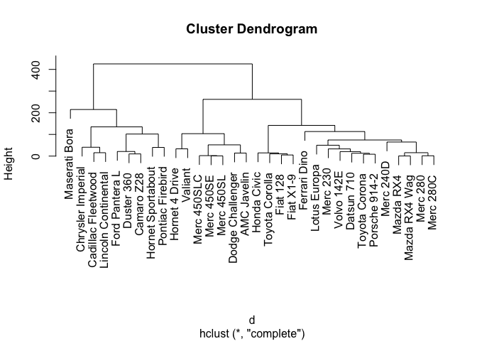

**This code/text was taken directly from EEMB 146 Lab 9 created by Tatum Katz in Spring of 2020.**


## Cluster analysis

Cluster analysis is also an unsupervised machine learning technique, but is a little more straightforward than PCA. It does just what it says - it will cluster your observations into groups based on how similar they are! With cluster analysis, there are many decisions to make. How many groups do you want? How will you define "similarity"? All of these choices need to be justified either statistically or biologically. Cluster analysis is great for "letting the data speak for itself" and understanding the relatedness of your observations. There are many ways to perform cluster analysis, but here I will show you the hierarchical agglomerative approach. There are no assumptions for this technique?! Other than the usual "good data" assumption, of course.

In the hierarchical approach, you use your predictors to calculate the "distance" between each data point. At each step of the algorithm, the two most similar points (or clusters) will be grouped together. The hierarchical approach will go on until every point is grouped into one giant, final group. Then, you must decide where to cut your new decision tree to determine the number of clusters! Agglomerative just means we build the tree from points to one group, instead of starting with one giant group and then splitting it down to individual points.

>[Hierarchical clustering explained](https://towardsdatascience.com/hierarchical-clustering-explained-e58d2f936323#:~:text=Hierarchical%20clustering%20means%20creating%20a,Agglomerative%20clustering)  
>[Hierarchical cluster analysis in R](https://www.r-bloggers.com/hierarchical-clustering-in-r-2/)

Example 1: hierarchical clustering

```r
### Cluster Analysis: the hierarchical agglomerative flavor ###


library(dendextend)
library(factoextra)

data(mtcars) #another CLASSIC r dataset!

# step 1: calculate the distance matrix and generate the clusters

d <- dist(as.matrix(mtcars)) #data must be in a matrix for dist to work

hc <- hclust(d) #this actually runs the hierarchical clustering algorithm, based on the distances you just calculated. hclust uses the "complete linkage" method by default to define the clusters


# step 2: analyze results

plot(hc) #holy dendrogram, batman!
```

<!-- -->

```r
fviz_nbclust(mtcars, FUN=hcut, method="wss") #get an elbow plot, just like PCA! pick the k that reduces your total within sum of squares sufficiently
```

<!-- -->

```r
fviz_nbclust(mtcars, FUN=hcut, method="silhouette") #average silhouette method to determine optimal k. measures the quality of the clustering, ie how well each datapoint lies within its cluster. high average silhouette width indicates good clustering
```

<!-- -->

```r
# step 3: beautiful plotting

dend <- as.dendrogram(hc) #generate the dendrogram
dend <- color_branches(dend, k=3) #color based on the number of clusters you determined
dend <- set(dend, "labels_cex", 0.5) #reduce label size so they all fit nicely
plot(dend)
```

<!-- -->

### Exericises 

Use the links above and help files in the R documentation (ie, ?function) to answer the questions below

1. What type of distance does dist() use by default? What are some other options you can use?
2. Explain what complete linkage means.
3. What are some disadvantages of cluster analysis?
4. What k would you select for the above analysis? Why?

### Answers (cause I know you want em)
1. Dist uses Euclidean distance by default. You could also choose manhattan distance or cosine similarity

2. Under complete linkage, for each pair of clusters, the algorithm computes and merges them to minimize the maximum distance between the clusters, ie the distance of the farthest elements

3. Some disadvantages are computational cost, it is sensitive to noise and outliers, and we have to define the number of clusters

4. Really any value between 2 and 4 is a good answer, they should explain why based on the elbow plot and silhouette plot

>[Another example of clustering code](https://www.r-bloggers.com/2016/01/hierarchical-clustering-in-r-2/)


```r
clusters <- hclust(dist(iris[, 3:4]))
plot(clusters) # creates dendrogram
```

<!-- -->

```r
# best choices for total number of clusters are either 3 or 4

# we can cut off tree at the desired numbers of clusters

clusterCut <- cutree(clusters, 3)

# let's compare it with the original species

table(clusterCut, iris$Species)
```

```
##           
## clusterCut setosa versicolor virginica
##          1     50          0         0
##          2      0         21        50
##          3      0         29         0
```

```r
# let's see if there is better linkage method: the mean linkage method

clusters <- hclust(dist(iris[, 3:4]), method = "average")
plot(clusters) # new dendrogram
```

<!-- -->

```r
# let's compare with new method
clusterCut <- cutree(clusters, 3)
table(clusterCut, iris$Species)
```

```
##           
## clusterCut setosa versicolor virginica
##          1     50          0         0
##          2      0         45         1
##          3      0          5        49
```

```r
ggplot(iris, aes(Petal.Length, Petal.Width, color = iris$Species)) + 
  geom_point(alpha = 0.4, size = 3.5) + geom_point(col = clusterCut) + 
  scale_color_manual(values = c('black', 'red', 'green'))
```

```
## Warning: Use of `iris$Species` is discouraged.
## ℹ Use `Species` instead.
```

<!-- -->

```r
# all the points where the inner color doesn't match the outer color are the ones which were clustered incorrectly 
```

Example 3: Non-hierarchical clustering
> [Non-hierarchical clustering](https://bookdown.org/content/6ef13ea6-4e86-4566-b665-ebcd19d45029/7-4-non-hierarchical-clustering.html)


```r
# you will need to download data from link above - sorry ran out of time to do this!
library(tidyverse) 
library(readxl)

equipment <- read_excel("segmentation_office.xlsx","SegmentationData") %>%
  mutate(respondent_id = factor(respondent_id),
         professional = factor(professional, labels = c("non-professional","professional")))

# there is an element of randomness in cluster analysis
# this means that you will not always get the same output every time you do a cluster analysis
# if you do want to always get the same output, you need to fix R's random number generator with the set.seed command
set.seed(1)

# the nstart argument should be included and set to 25, but its explanation is out of the scope of this tutori al
kmeans.clustering <- kmeans(cluster.data, 3, nstart = 25)

# Add to the equipment dataset a variable that indicates to which cluster an observation belongs

equipment <- equipment %>% 
  mutate(km.group = factor(kmeans.clustering$cluster, labels=c("cl1","cl2","cl3"))) # Factorize the cluster indicator from the kmeans.clustering data frame and add it to the equipment data frame.

# Inspect the clusters:

equipment %>% 
  group_by(km.group) %>% # group by cluster (km.group)
  summarise(count = n(), 
            variety = mean(variety_of_choice), 
            electronics = mean(electronics), 
            furniture = mean(furniture), 
            service = mean(quality_of_service), 
            prices = mean(low_prices), 
            return = mean(return_policy)) # Then ask for the number of respondents and for the means of the ratings.

## `summarise()` ungrouping output (override with `.groups` argument)
```

We see that:

cluster 1 attaches more importance (than other clusters) to quality of service

cluster 2 attaches more importance to variety of choice

cluster 3 attaches more importance to low prices

