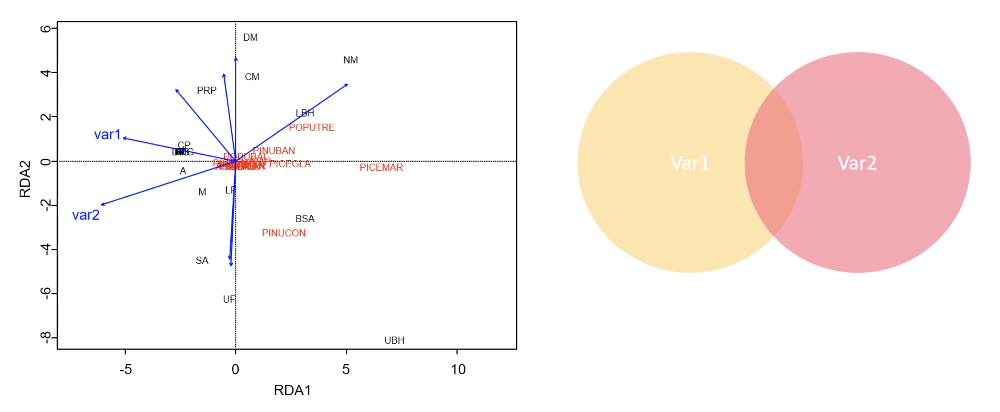
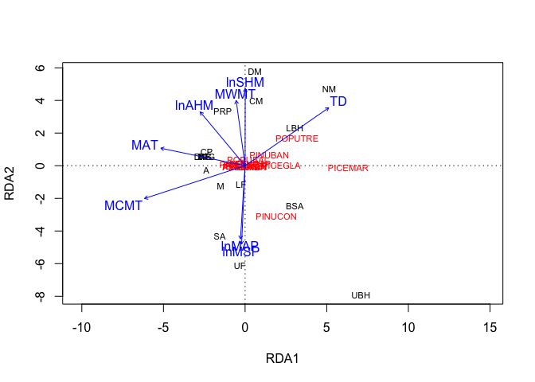
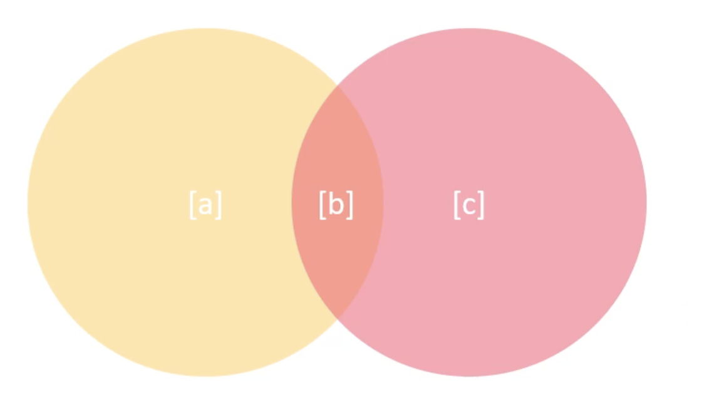
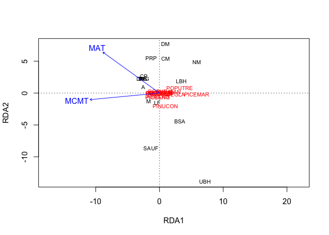
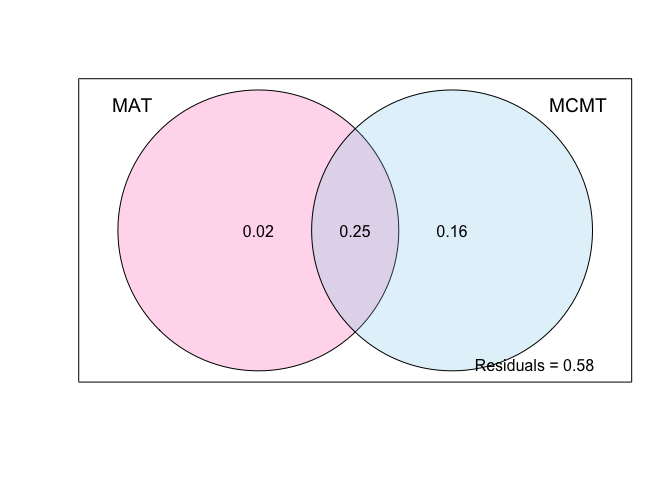
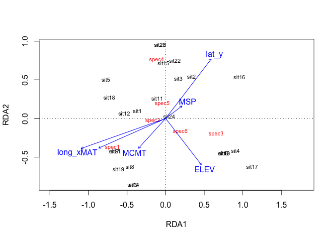
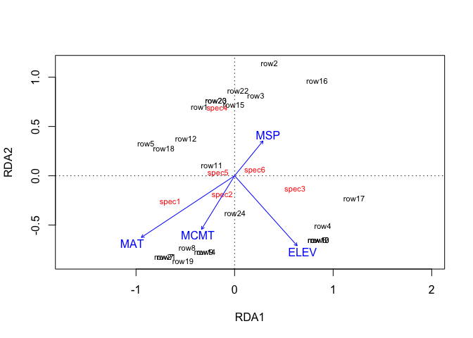
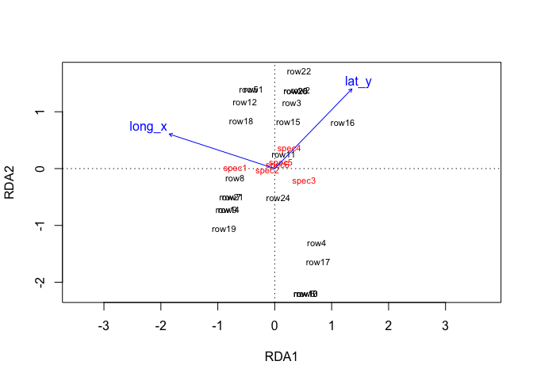
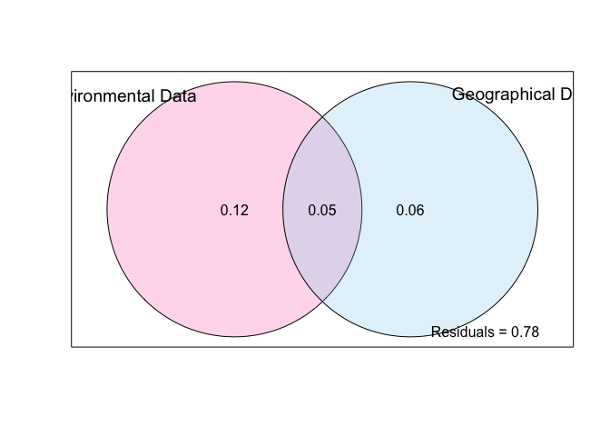

# 0. Credits

Material is taken directly from Mariah Casmey's lesson on variance partitioning for the University of Alberta's class on [Multivariate Statistics for the Environmental Sciences](https://sites.ualberta.ca/~ahamann/teaching/renr690/).

# 1. Why do variance partitioning?

Variance partitioning allows you to **explain the amount of unique and shared variance explained by predictor variables used in RDA, CCA, or multiple linear regression**. Usually people refer to this as variance partitioning for multivariate analyses and commonality analysis for univariate analyses, but they are the same thing. These techniques are valuable because the problem with these different analyses is that you can't necessarily parse the effects of correlated variables on your response variables (for the multivariate case, this would be community composition).  

You can prove to yourself that your predictor variables are related to each other by plotting them against each other or by creating a correlation plot. This is called **multicollinearity** - you know there is some variance these variables explain but you don't actually know how much they do explain.  

Variance partitioning allows you to figure that out by examining the effects of correlated variables all together and separately. The results are usually visualized in a venn diagram showing the unique effects of variables and their overlap.  



An example of this is when you have community data with some environmental data taken for each site. You've done a RDA to figure out how much of the variation on community composition is due to your environmental variables, but now you don't necessarily know 1) how much of your environmental variables explain that variation independently of each other/in combination, or 2) how much distance between sites might be contributing to variation in community composition.  

To figure these out, you can use variance partitioning on the explanatory variables in your environmental variable set (e.g. soil moisture, N, temperature) _or_ you can use variance partitioning on two different matrices (e.g. your environmental variables and spatial position of each site). 

# 2. How it works

There are three basic steps for variance partitioning:  

1. Full model: calculate the variation explained by a model containing all of the variables  
2. Partial model: calculate the fractions of variance explained by each variable (imagine the overlaps in the venn diagram)  
3. Partition the variance: subtract fractions from the full model to partition variance  

Note: variance partitioning uses the adjusted R^2 of each model as a metric of the variance explained - this is because the unadjusted R^2 for different models will be inflated if there are different numbers of variables in each model (in step 2).

Assumptions:  
1. The variation in the data = 1, and the variance explained by the full model is given by the variance explained by the axes.  
2. The fraction of the variation accounted for by the axes of RDA or CCA is given by the eigenvalue divided by the number of variables. The sum of the axes gives the variance explained by an RDA or CCA model. 

# 3. Variance partitioning


```r
library(vegan)
library(tidyverse)
library(here)

temp <- read_csv(here::here("week_07/data/AB_Climate_Trees.csv")) %>% 
  column_to_rownames("ECOSYS")

species <- temp %>% 
  select(10:22)

environ <- temp %>% 
  select(2:9)

geogr <- temp %>% 
  select(1)
```

So let's say you do a RDA on your dataset:


```r
spec.rda <- rda(species ~ ., data = environ)
plot(spec.rda)
```

<!-- -->

It seems like MAT and MCMT are somewhat related. We can investigate their relationship with variance partitioning. We'll create a model with only those two variables to look at their relationship with the species frequency data.





```r
# 1. RDA of full model
rda.all <- rda(species ~ MAT + MCMT, data = environ)

# 2. RDA of partial models
rda.MAT <- rda(species ~ MAT, data = environ)
rda.MCMT <- rda(species ~ MCMT, data = environ)

# check to see if the plot looks similar to what it did up top - it does
plot(rda.all, choices = c(1,2), type = "text")
```

<!-- -->

For the final step in variance partitioning, we'll calculate the fractions of each adjusted R^2.

```r
# full model
abc <- RsquareAdj(rda.all)$adj.r.squared

# RDA of partial models
ab <- RsquareAdj(rda.MAT)$adj.r.squared
bc <- RsquareAdj(rda.MCMT)$adj.r.squared

# individual fractions
b <- ab + bc - abc
a <- ab - b
c <- bc - b
```

Seems a little tedious. Good thing there's a `vegan` function for that! `varpart` does the fraction calculating for you and also makes a nice plot.


```r
out <- varpart(species, ~ MAT, ~ MCMT, data = environ)
out$part$fract
```

```
##                 Df R.squared Adj.R.squared Testable
## [a+c] = X1       1 0.3113152     0.2654028     TRUE
## [b+c] = X2       1 0.4453240     0.4083456     TRUE
## [a+b+c] = X1+X2  2 0.4966052     0.4246917     TRUE
```

```r
out$part$indfract
```

```
##                 Df R.squared Adj.R.squared Testable
## [a] = X1|X2      1        NA    0.01634604     TRUE
## [b] = X2|X1      1        NA    0.15928885     TRUE
## [c]              0        NA    0.24905680    FALSE
## [d] = Residuals NA        NA    0.57530832    FALSE
```

```r
plot(out, bg = c("hotpink","skyblue"), Xnames = c("MAT", "MCMT"))
```

<!-- -->

You can also do this for data with multiple matrices of information - for example, if you have both environmental and location data for your sites.


```r
# load in and some cleaning
temp <- read_csv(here::here("week_07/data/SpeciesDat.csv"))
rownames(temp) <- paste(temp$BIOME, temp$plotNum)

species2 <- temp %>% 
  select(10:15)

environ2 <- temp %>% 
  select(4:6, 9)

geogr2 <- temp %>% 
  select(2:3)
```

Looking at ordination to see if any variables seem highly related to geographic variables:

```r
rda.both <- rda(species2, temp[, c(2:6, 9)])
plot(rda.both, choices = c(1,2), type = "text")
```

<!-- -->

Just the environmental data:

```r
rda.environ2 <- rda(species2 ~ ., data = environ2)
plot(rda.environ2, choices = c(1,2), type = "text")
```

<!-- -->

And just latitude and longitude:

```r
rda.geogr2 <- rda(species2 ~ ., data = geogr2)
plot(rda.geogr2, choices = c(1,2), type = "text")
```

<!-- -->

And now, the variance partitioning:

```r
out2 <- varpart(species2, environ2, geogr2)
plot(out2, bg = c("hotpink", "skyblue"), Xnames = c("Environmental Data", "Geographical Data"))
```

<!-- -->

# 4. Significance testing

You can test the significance of these fractions by using `anova`. When you look at the output of `varpart`, there will be a column called "Testable" telling you whether or not that fraction can be expressed as an RDA for testing. All fractions can be tested except for the overlap between variables on its/their own, and the residuals.


```r
out2
```

```
## 
## Partition of variance in RDA 
## 
## Call: varpart(Y = species2, X = environ2, geogr2)
## 
## Explanatory tables:
## X1:  environ2
## X2:  geogr2 
## 
## No. of explanatory tables: 2 
## Total variation (SS): 32.167 
##             Variance: 1.3986 
## No. of observations: 24 
## 
## Partition table:
##                      Df R.squared Adj.R.squared Testable
## [a+c] = X1            4   0.31033       0.16513     TRUE
## [b+c] = X2            2   0.18120       0.10322     TRUE
## [a+b+c] = X1+X2       6   0.42386       0.22051     TRUE
## Individual fractions                                    
## [a] = X1|X2           4                 0.11729     TRUE
## [b] = X2|X1           2                 0.05538     TRUE
## [c]                   0                 0.04784    FALSE
## [d] = Residuals                         0.77949    FALSE
## ---
## Use function 'rda' to test significance of fractions of interest
```

```r
# abc
anova(rda.both)
```

```
## Permutation test for rda under reduced model
## Permutation: free
## Number of permutations: 999
## 
## Model: rda(X = species2, Y = temp[, c(2:6, 9)])
##          Df Variance      F Pr(>F)   
## Model     6  0.59278 2.0844  0.002 **
## Residual 17  0.80577                 
## ---
## Signif. codes:  0 '***' 0.001 '**' 0.01 '*' 0.05 '.' 0.1 ' ' 1
```

```r
# ab
anova(rda.environ2)
```

```
## Permutation test for rda under reduced model
## Permutation: free
## Number of permutations: 999
## 
## Model: rda(formula = species2 ~ MAT + MSP + ELEV + MCMT, data = environ2)
##          Df Variance      F Pr(>F)   
## Model     4  0.43401 2.1373  0.005 **
## Residual 19  0.96454                 
## ---
## Signif. codes:  0 '***' 0.001 '**' 0.01 '*' 0.05 '.' 0.1 ' ' 1
```

```r
# bc
anova(rda.geogr2)
```

```
## Permutation test for rda under reduced model
## Permutation: free
## Number of permutations: 999
## 
## Model: rda(formula = species2 ~ lat_y + long_x, data = geogr2)
##          Df Variance      F Pr(>F)   
## Model     2  0.25342 2.3236   0.01 **
## Residual 21  1.14513                 
## ---
## Signif. codes:  0 '***' 0.001 '**' 0.01 '*' 0.05 '.' 0.1 ' ' 1
```

```r
# a
anova(rda(species2 ~ environ2$MAT + environ2$MSP + environ2$ELEV + environ2$MCMT + 
            Condition(geogr2$lat_y + geogr2$long_x)))
```

```
## Permutation test for rda under reduced model
## Permutation: free
## Number of permutations: 999
## 
## Model: rda(formula = species2 ~ environ2$MAT + environ2$MSP + environ2$ELEV + environ2$MCMT + Condition(geogr2$lat_y + geogr2$long_x))
##          Df Variance    F Pr(>F)  
## Model     4  0.33937 1.79  0.017 *
## Residual 17  0.80577              
## ---
## Signif. codes:  0 '***' 0.001 '**' 0.01 '*' 0.05 '.' 0.1 ' ' 1
```

```r
# c
anova(rda(species2 ~ geogr2$lat_y + geogr2$long_x + 
            Condition(environ2$MAT + environ2$MSP + environ2$ELEV + environ2$MCMT)))
```

```
## Permutation test for rda under reduced model
## Permutation: free
## Number of permutations: 999
## 
## Model: rda(formula = species2 ~ geogr2$lat_y + geogr2$long_x + Condition(environ2$MAT + environ2$MSP + environ2$ELEV + environ2$MCMT))
##          Df Variance      F Pr(>F)  
## Model     2  0.15878 1.6749  0.075 .
## Residual 17  0.80577                
## ---
## Signif. codes:  0 '***' 0.001 '**' 0.01 '*' 0.05 '.' 0.1 ' ' 1
```


